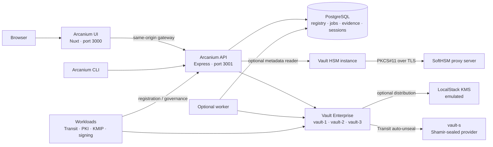

# Architecture

Arcanium separates cryptographic custody from management. Vault holds keys and certificates, authenticates workloads and enforces cryptographic policy. Arcanium expresses business intent, records metadata and coordinates supported lifecycle operations.

## System view

The worker, HSM reader, audit ingestion and external KMS integration require explicit configuration. Their source files do not imply that their services are running.

## Service boundaries

| Component | Responsibility | Not its responsibility |
| --- | --- | --- |
| Nuxt UI | Navigation, rendering, filters, forms, pagination, drawers and API transport | Vault credentials, direct Vault calls, authoritative security decisions |
| Express API | Registry, Vault integration, provisioning orchestration, approval records, evidence and maturity API | Replacing all Vault administration |
| PostgreSQL | Supplier/application metadata, profiles, approvals, jobs, sessions and evidence | Private key custody |
| Vault cluster | Cryptographic state, policies, auth engines, namespaces, Transit, PKI and KMIP | Business-facing dashboard |
| Worker | Optional queued jobs and audit ingestion | An independent authoritative registry |
| Workloads | Demonstrate actual crypto operations using workload identities | Sharing root credentials with the browser |

Arcanium normally manages metadata and configuration. The implemented rewrap endpoint is a specific ciphertext-only exception: the API sends ciphertext to Vault for rewrapping. Do not describe the API as never making any cryptographic data-plane call.

## Vault topology and health

`vault-1`, `vault-2` and `vault-3` form one Raft cluster. One is active; the others can be healthy standbys. `vault-s` is a separate Transit seal provider. `vault-hsm` is a separate HSM demonstration instance, not another Raft peer in the main cluster.

A healthy standby is operational. Dashboard health must be based on reachability, initialization and seal state, with special unhealthy status codes handled explicitly. Role labels such as leader and standby are separate from health. Vault HTTP `429` means an unsealed standby; it is not an ordinary failed health probe. See [Vault health semantics](https://developer.hashicorp.com/vault/api-docs/system/health).

All node probes originate in the API over TLS. Browser access to the independent Vault UI is an explicit navigation, not a frontend data dependency.

## Networks and ports

| Service | Host listener | Principal network |
| --- | --- | --- |
| Arcanium UI | `127.0.0.1:3000` | `arcanium-control` |
| Arcanium API | `127.0.0.1:3001` | control and Vault-internal |
| PostgreSQL | `127.0.0.1:5432` | control |
| Adminer | `127.0.0.1:5050` | control |
| vault-s | `127.0.0.1:18190` | Vault-internal |
| vault-1 / vault-2 / vault-3 | `127.0.0.1:18200` / `18201` / `18202` | Vault-internal |
| vault-hsm | `127.0.0.1:18300` | Vault-internal |
| Grafana, optional | `127.0.0.1:3010` | control |
| Prometheus, optional | `127.0.0.1:9090` | control and Vault-internal |
| OTel collector, optional | `127.0.0.1:4317`, `4318` | control |
| LocalStack KMS, optional | `127.0.0.1:4566` | control and Vault-internal |

The UI must not join `arcanium-vault-internal`. The HSM proxy uses its internal TLS socket on port 2345. Compose files are authoritative for actual listeners and membership.

## Data and control flows

### API startup

1. Validate required configuration.
2. Authenticate to Vault through AppRole.
3. Obtain dynamic PostgreSQL credentials from Vault.
4. Initialize the database pool and apply numbered SQL migrations.
5. Start HTTP routes and credential refresh loops.

An API startup failure can therefore originate in Vault, licensing, TLS, AppRole, database configuration or migration execution.

### Supplier and application provisioning

Terraform establishes baseline engines, parent namespaces, policies and demonstration resources. Runtime provisioners create supported tenant/workload resources and record ordered steps in `provisioning_jobs`. `PROVISION_MODE=sync` executes in the API; `queue` leaves pending work for the worker. Rollback is best effort and its individual steps must be inspected.

Supplier creation can provision a Vault namespace. Deletion can deprovision it. A metadata-only request uses the explicitly documented dry creation option; never assume CRUD is harmless registry editing. See [orchestration](orchestration.md).

### Governance

Approval records carry requester, action, target, source, status and optional accessor. Database approval and Vault-native authorization are distinct. The current approval route records decisions; scripts may perform the Vault authorization separately. A record marked approved is not proof that a key operation ran.

### Evidence and maturity

Evidence may combine approval records with normalized audit-log metadata when ingestion is enabled and the worker can read its audit mount. Source classification is an integration signal, not an independent identity attestation. The maturity endpoint evaluates currently implemented checks; the UI should render the server report when supported. See [maturity](maturity-model.md) and [capabilities](capabilities.md) for measurement limits.

## Persistence

Vault Raft, Vault audit data, HSM token storage and PostgreSQL use persistent volumes. Optional Prometheus and Grafana also use volumes. LocalStack configuration currently provides no persistent volume; do not assume emulator keys survive recreation.

Local `.env`, `.env.workloads`, `.secrets/`, TLS private material, licenses and Terraform state need separate protection. A volume's existence is not a verified backup. [Operations](operations.md) describes backup and restart boundaries.

## Implementation references

- [API entrypoint](../arcanium/api/src/index.js)
- [API configuration](../arcanium/api/src/config.js)
- [Provisioner runner](../arcanium/api/src/provisioner/steps.js)
- [Worker](../arcanium/api/src/worker.js)
- [UI configuration](../arcanium/ui/nuxt.config.ts)
- [Compose stack index](../compose/README.md)
